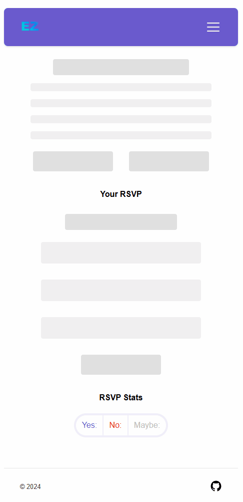

# RSEZ
Lightweight RSVP app that focuses on simplicity and accessibility.

RSEZ makes it easy to for event organizers to share their events and for guests to RSVP without barriers. The goal is to minimize friction so people can quickly and easily respond to an invitation.

I was inspired to make this tool by the realization that many event platforms, like social media sites, rely on users being a part of their ecosystem to participlate. After stepping away from one of the largest social media platforms, I saw how much I depended on it to learn about my firend's events. 

This app embraces accessibility and openness. Event organizers are the only ones who are required to make an account. Guests can RSVP without an account, and if they choose to creat an account late, their RSVP will be linked automatically. With RSEZ, eveyone can participate seamlessly.


## Key Features

1. Event Creation & Sharing
    - Organizers can create events, view incoming RSVPs, and manage the event
    - Events create a sharable link that can be easily sent to invitees
    - "Add to Calender" and "Open in Maps" hooks into expected functionallity

2. Guest RSVP and Account Linking
    - Guests can RSVP without being logged in
    - If later they login, their RSVP seamlessly links to their profile

3. Reactive Design
    - Responsive design provides seamless experience on any platform
    - Loading pages gracefully handle asynchronous requests by showing skeleton components

<p float="left">
    
    
</p>

## Tech Stack

### Frontend 

- **React**: create a responsive and dynamic frontend, by taking advantage of State and Context.  
- **Next.js**: handle routing and server side rendering  
- **Javascript**: uses JSX extension to integrate **HTML**. Using **CSS** for styling  

### Backend

- **Flask**: created a API backend that handles authentication and database intereactions.  
- **SQLAlchemy**: for object relational mapping, running SQLite for development.  
- **Python**:  

### Outside Tools

VS Code  
Krita  
Iconfinder

<!-- ## Highlights

[lorem ipsum]

## Implementation Details

[lorem ipsum]

## Possible Improvements

[lorem ipsum] -->

## Run it yourself
### Backend Setup
#### 1. Clone the repository:
```bash
git clone https://github.com/skylarbeaty/Easy-RSVP.git
```
#### 2. Create a virtual envirnment:
```bash
cd Easy-RSVP/backend
python -m venv venv
venv\Scripts\activate #on windows
```
#### 3. Install dependancies:
```bash
pip install -r requirements.txt
```
#### 4. Create .env file:
Create a file in the back called ".env" and add this line.
```bash
FLASK_SECRET_KEY=your_key_here
```
Replace "your_key_here" with a secure and random string
#### 5. Run the server:
```bash
flask run
```
This project is still setup for development. \
The database will be automatically setup when you run the app.
### Frontend Setup
#### 1. Install dependancies:
```bash
cd Easy-RSVP/frontend
npm install
```
#### 2. Start the server
```bash
npm run
```
#### 3. View the site
Follow the link in the console to view the site.  
It should be visible at [localhost:3000](http://localhost:3000)

<!-- ## Run it yourself
### Backend Setup
```bash
# 1. Clone the repository:
git clone https://github.com/skylarbeaty/Easy-RSVP.git

# 2. Create a virtual envirnment:
cd Easy-RSVP/backend
python -m venv venv
source venv\Scripts\activate #on windows

# 3. Install dependancies:
pip install -r requirements.txt

# 4. Setup envirnment 
touch .env # or create a text file named ".env" in backend
```
Add this line to .env
```
FLASK_SECRET_KEY=your_key_here
```
Replace "your_key_here" with a secure and random string
```bash
# 5. Run the server:
flask run
```
### Frontend Setup
```bash
# 1. Install dependancies:
cd Easy-RSVP/frontend
npm install

# 2. run the frontend
npm run dev

# 3. Follow console link to view, or navigate to localhost:3000
``` -->
